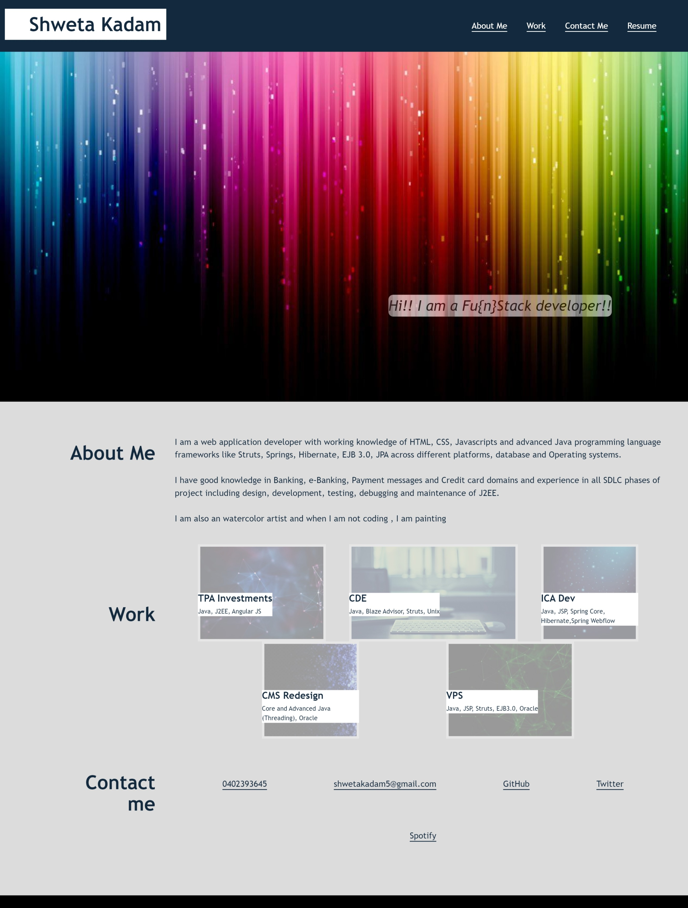

# <Your-Project-Title>

## Description

A web application for the portfolio of work has been developed to showcase the skills and talents to employers looking to fill a part-time or full-time position.
The development of this application has helped me apply the knowledge of HTML, CSS, various styling and transition options of CSS , flexbox, media queries, and CSS variables.  

## Table of Contents 

- [Installation](#installation)
- [User Story](#user-story)
- [Usage](#usage)
- [Tests](#tests)
- [Acceptance Criteria](#acceptance-criteria)
## Installation

1. Create a new repository on your GitHub account and clone it to your computer.

2. When you're ready to deploy, use the git add, git commit, and git push commands to save and push your code to your GitHub repository.

3. Navigate to your GitHub repository in the browser and then select the Settings tab on the right side of the page.

4. On the Settings page, select Pages on the left side of the page. On the GitHub Pages screen, choose main in the dropdown under Branch. Click the Save button.

5. Navigate to <your-github-username.github.io/your-repository-name> and you will find that your new webpage has gone live! For example, if your GitHub username is "lernantino" and the project is "css-demo-site", then your URL would be <lernantino.github.io/css-demo-site>.

## User Story

```
AS AN employer
I WANT to view a potential employee's deployed portfolio of work samples
SO THAT I can review samples of their work and assess whether they're a good candidate for an open position
```


## Usage
Once the website is live, the following webpage should be displayed to the user where all the navigation links should navigate to necessary sections and provide accessibility texts for the various tools.

Link for the repository : https://github.com/shwetakadam5/portfolio-shwetakadam

Link for the website : https://shwetakadam5.github.io/portfolio-shwetakadam/





## Tests

**Test 1** : Click on all the links on the navigation and check if redirected to the appropriate content.
- Click on the link About Me : User will be navigated to the details of about me on the webpage.
- Click on the link Work : User will be navigated to the details of work/projects on the webpage.
- Click on the link Contact Me : User will be navigated to the details of contact me on the webpage.
- Click on the link Resume : User will download a "resume" document.

**Test 2** : Hovering on the navigation links will highlight the sections and display appropriate texts.
- Hover on the link About Me : Hover text will display "Click to visit About Me"
- Hover on the link Work : Hover text will display "Click to visit Work details"
- Hover on the link Contact Me : Hover text will display "Click to visit Contact Me details"
- Hover on the link Resume : Hover text will display "Click to download resume"

- Hover on the link 0402393645 : Hover text will display "Click to call the Contact Number 0402393645"
- Hover on the link shwetakadam5@gmail.com : Hover text will display "Click to send email to shwetakadam5@gmail.com"
- Hover on the link GitHub : Hover text will display "Click to navigate to the GitHub account"
- Hover on the link Twitter : Hover text will display "Click to navigate to the Twitter account"
- Hover on the link Spotify : Hover text will display "Click to navigate to the Spotify account"


**Test 3** :
- Hover on the images : Opacity of the image will change of the respective image.

**Test 4** : 
- Check if appropriate alt text is displayed if the image fails to load for some reason.

**Test 5**: 
- Check appropriate headers are displayed for every section.

**Test 6** : 
- Check the title of the webpage upon loading.


## Acceptance Criteria

Here are the critical requirements necessary to develop a portfolio that satisfies a typical hiring manager’s needs:

```
GIVEN I need to sample a potential employee's previous work
WHEN I load their portfolio
THEN I am presented with the developer's name, a recent photo or avatar, and links to sections about them, their work, and how to contact them
WHEN I click one of the links in the navigation
THEN the UI scrolls to the corresponding section
WHEN I click on the link to the section about their work
THEN the UI scrolls to a section with titled images of the developer's applications
WHEN I am presented with the developer's first application
THEN that application's image should be larger in size than the others
WHEN I click on the images of the applications
THEN I am taken to that deployed application
WHEN I resize the page or view the site on various screens and devices
THEN I am presented with a responsive layout that adapts to my viewport
```